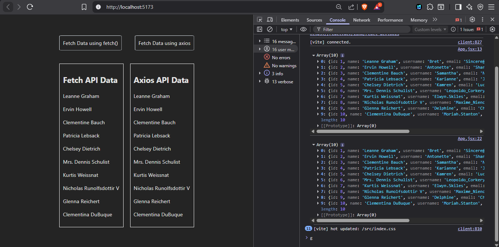

## Api Calling in React 

- In this project i have called the API using fetch() api and axios to learn Api calling in react

### How to install axios
- To install (on terminal) - npm install axios
- import statement : import axios from 'axios';

### 📸 Snapshot :

