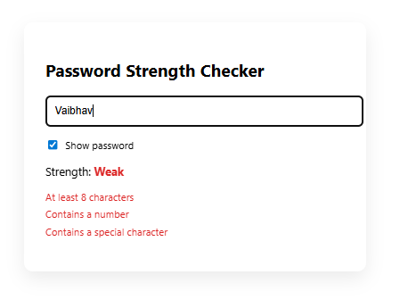
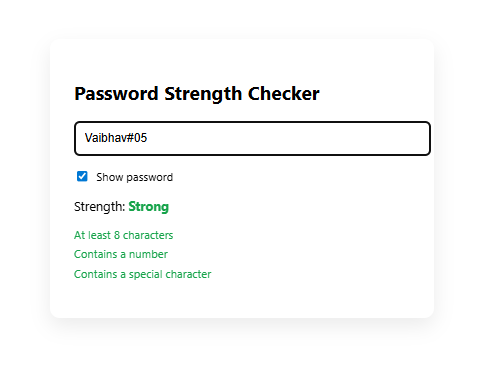
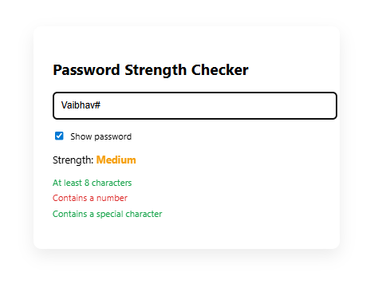

## React Hooks - useState() 

- Learning react hooks
- useState() function of React core 
- How state changes and how to handle the state chnages 

## Project - ( Password Strenth Checker )

## 📸 Snapshot

