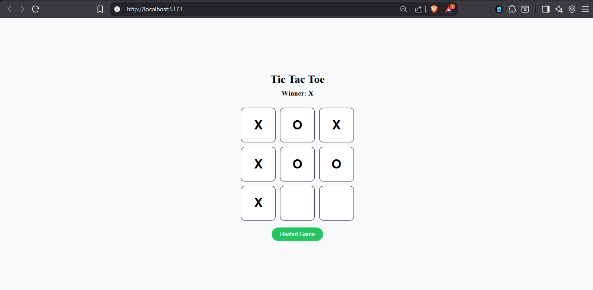

## React Hooks - useState() 

- Learning react hooks
- useState() function of React core 
- How state changes and how to handle the state chnages 

## Project - ( Tic Tac Toi )

- useState is used to handle the states of O and X and make decision 

## 📸 Snapshot

