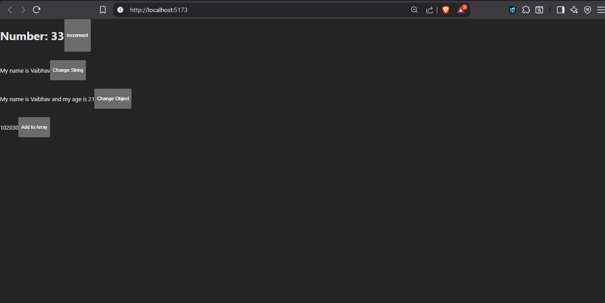

## React Hooks - useState() 

- Practicing useState 

## State Management Basics
- useState deep dive
- Updating state correctly (object, array, immutability)
- Batch Update in react
- Event Handling with react

## 📸 Snapshot

